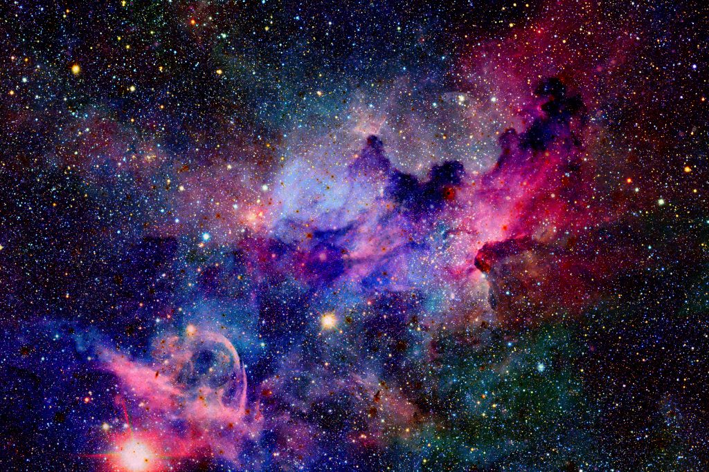

<!DOCTYPE html>
<html>
    <head>
        <meta name="viewport" content="width=device-width, initial-scale=1">
        
        
    </head>
    <body style="background-color: black;">
        <video autoplay muted loop id="myVideo">
            <source src="explore.mp4" type="video/mp4">
        </video>
        

            <h1 style="text-align: left; color: rgb(255, 255, 255);">
                <a href="home.html">
                Vikkytech
                </a>
            </h1>

            <nav class="nav">
                

                    <a href="#"> Home </a> 
                    <a href="#"> About </a> 
                    <a href="#"> Contact</a> 
                    <a href="#"> signup </a> 
                

            </nav>
        

            

                We Unlock The Secret Of The Cosmos
            

          
        

            
            

                What Do You Know About Deep Space ?
            

          

              And it's endless possibilities
          

        

        

            <h1>
                Basic Facts About The Cosmos_
            </h1>
        

        

             
              

                Throughout history, humans have gazed up at the stars and contemplated the cosmos. This fascination with the night sky has evolved over time, from looking up at the Milky Way to building instruments that magnify the distant unknown to launching telescopes into outer space. For some ancient civilizations, the awe-inspiring spectacle of the night sky pervaded social, cultural, and religious life. Today, the stars still captivate the interest of young and old alike. In this respect, astronomy ties together our past and our future. Our ancestors, looking at the same celestial bodies we do, invested them with significance and meaning. And in the the modern era, we look at the same sky, albeit with more refined instruments, and build the foundation of new technologies and new knowledge.
              

              

                Astronomy is an early science, one that involves observing celestial bodies to measure their positions and properties. As our knowledge of the world around us has developed, scientists began to apply physics to understand astronomy; the field of astrophysics. While the two fields have distinct histories, the terms astronomy and astrophysics are now interchangeable since modern professional astronomers apply the principles of physics, math, and statistics to their work.
              

              

                Cosmos, in astronomy, the entire physical universe considered as a unified whole (from the Greek kosmos, meaning “order,” “harmony,” and “the world”). Humanity’s growing understanding of all the objects and phenomena within the cosmic system is explained in the article universe. For a history of the study of the universe as a unified whole, see cosmology.
              

             
        

        

             
         
            

                <b>  Point Of Study   </b>
                Having observed the stars in the sky and the planets in our own solar system, one question naturally arises, ‘Are we alone?’ In the third century BCE, the Greek philosopher Epicurus wrote, ‘There are infinite worlds both like and unlike ours…’
                 In 13th century China, the sage Teng Mu professed, ‘Outer space is like a kingdom and our Earth and sky are like no more than a single person in that kingdom.’, and Italian philosopher and astronomer Bruno further posited the existence of planets beyond the solar system in his 1584 work, De L’infinito Universo E Mondi. He wrote, ‘There are countless suns and countless Earths all rotating around their suns in exactly the same way as the planets of our system…the countless worlds are no worse and no less inhabited than our Earth.’ Remarkably, these claims purporting the existence of numerous planets throughout the universe were confirmed just two decades ago with the discovery of the first exoplanet, or planet outside of the solar system.
            
 
        

      

         

        footer
    

      

    </body>
</html>
